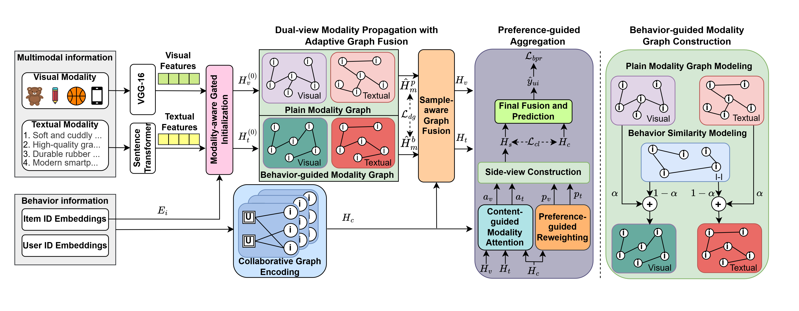
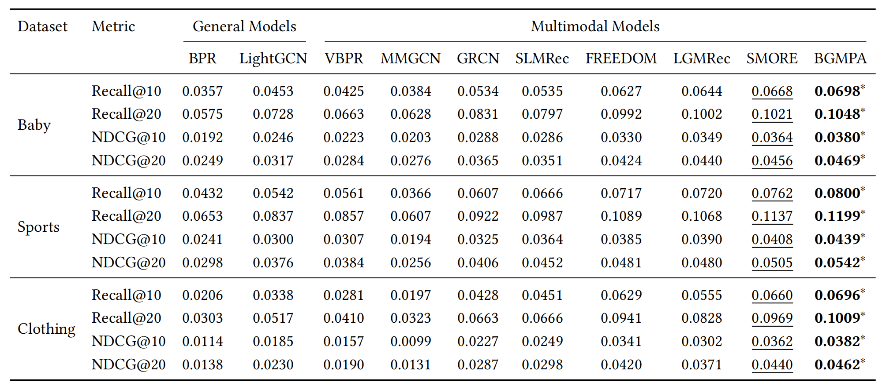

# BGMPA

This repository provides the PyTorch implementation of **BGMPA**:
**Behavior-guided Modality Graph Propagation with Preference Aggregation for Multimodal Recommendation**.


## Enviroment Requirement

Python 3.7

Pytorch 1.13

Install dependencies:

```bash
pip install -r requirements.txt
```

## Dataset

Download from Google Drive: Baby/Sports/Clothing

The data comprises text and image features extracted from Sentence-Transformers and CNN.

## How to run

Place the downloaded data, e.g., `baby`, into the `data` directory.

Enter the `src` folder and execute the following command:

```bash
python main.py -m BGMPA -d baby
```

Other parameters can be set either through the command line or by using the configuration files located in `configs/model/BGMPA.yaml` and `configs/dataset/*.yaml`.

## Performance Comparison



## Best hyperparameters for reproducibility

We present the optimal hyperparameters for BGMPA to replicate the results shown in Table 2 of our paper:

| Datasets | n_ui_layers | n_layers | image_knn_k | text_knn_k | behavior_graph_alpha | cl_loss | dual_graph_cl_weight | reg_weight | dropout_rate |
| --- | ---: | ---: | ---: | ---: | ---: | ---: | ---: | ---: | ---: |
| Baby | 4 | 1 | 40 | 10 | 0.6 | 0.01 | 0.002 | 1e-04 | 0.1 |
| Sports | 3 | 1 | 10 | 10 | 0.3 | 0.03 | 0.002 | 1e-04 | 0 |
| Clothing | 3 | 1 | 15 | 10 | 0.5 | 0.01 | 0.002 | 1e-05 | 0 |

## Citation

If you find BGMPA useful in your research, please consider citing our paper.

```bibtex
@inproceedings{bgmpa2026,
  title     = {Behavior-guided Modality Graph Propagation with Preference Aggregation for Multimodal Recommendation},
  author    = {Anonymous Author(s)},
  booktitle = {Anonymous Submission},
  year      = {2026}
}
```

This code is made available solely for academic research purposes.

## Acknowledgement

The structure of this code is inspired by the MMRec framework. We acknowledge and appreciate their valuable contributions.
